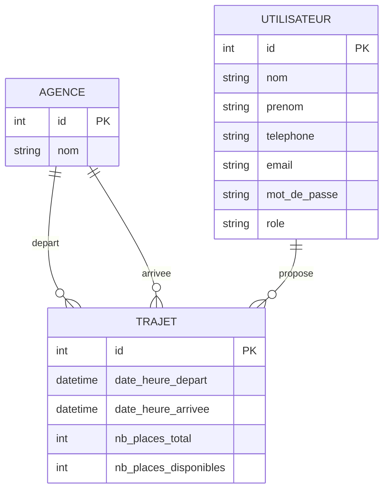

# Modèle Conceptuel de Données (MCD)

## Entités et associations

- **AGENCE** (`id`, `nom`) : une ville où l'entreprise est implantée.
- **UTILISATEUR** (`id`, `nom`, `prenom`, `telephone`, `email`, `mot_de_passe`, `role`) : un employé (importé du SIRH), potentiellement administrateur.
- **TRAJET** (`id`, `date_heure_depart`, `date_heure_arrivee`, `nb_places_total`, `nb_places_disponibles`) : un trajet proposé entre deux agences par un utilisateur.

## Associations

- Un **TRAJET** a pour agence de **DÉPART** une et une seule **AGENCE** ; une **AGENCE** peut être le départ de 0..n trajets.
- Un **TRAJET** a pour agence d'**ARRIVÉE** une et une seule **AGENCE** ; une **AGENCE** peut être l'arrivée de 0..n trajets.
- Un **TRAJET** est **PROPOSÉ PAR** un et un seul **UTILISATEUR** (l'auteur/contact) ; un **UTILISATEUR** propose 0..n trajets.

## Diagramme (Mermaid — à exporter en image via un rendu Mermaid si un format JPG/PNG est exigé)

